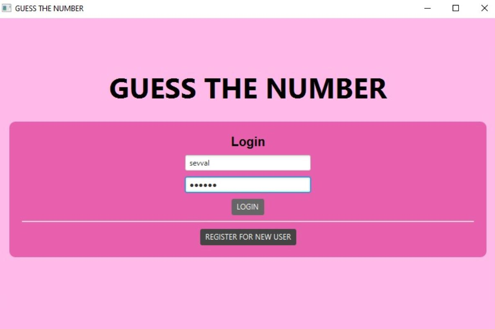
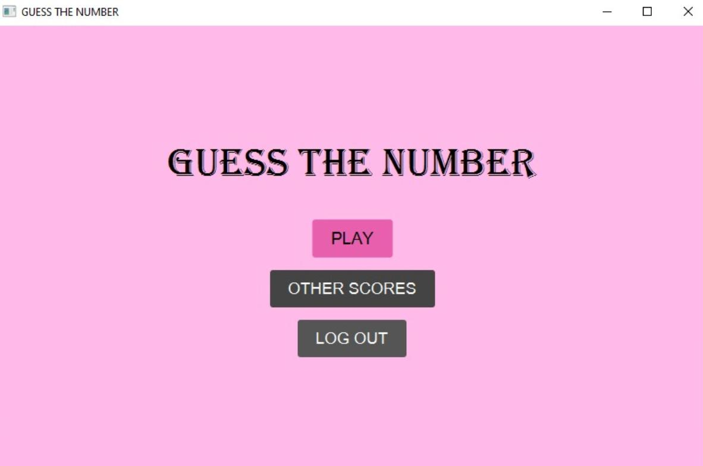
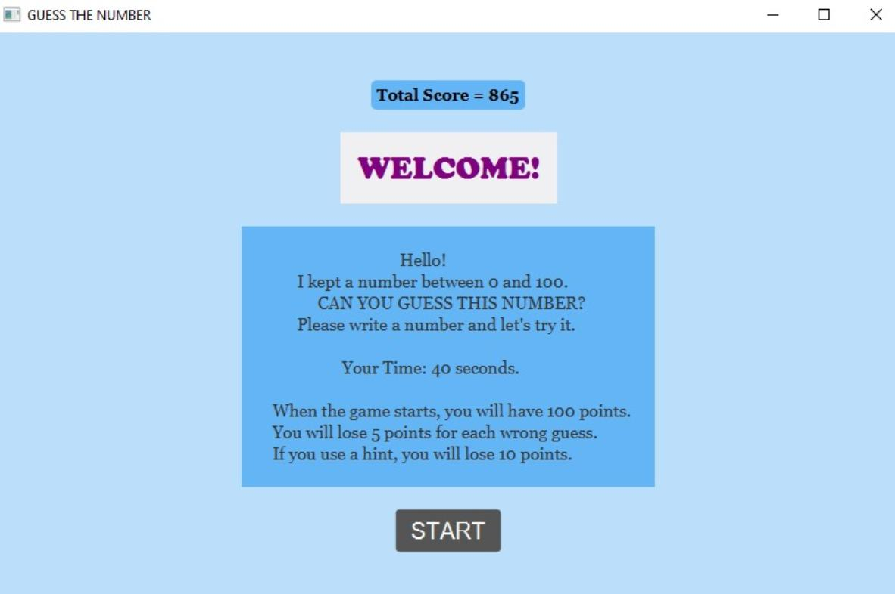
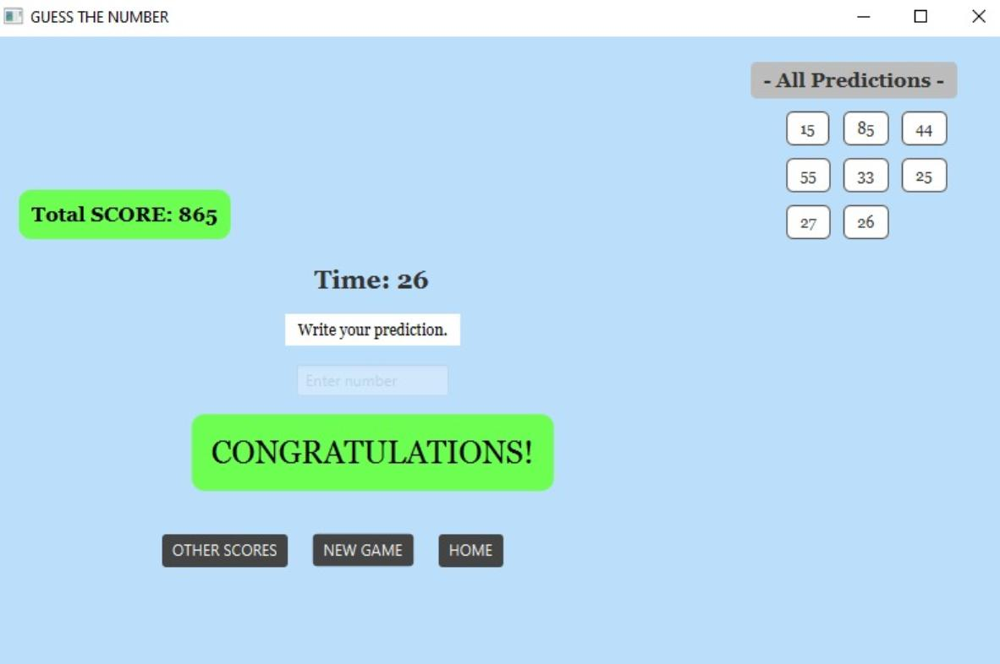
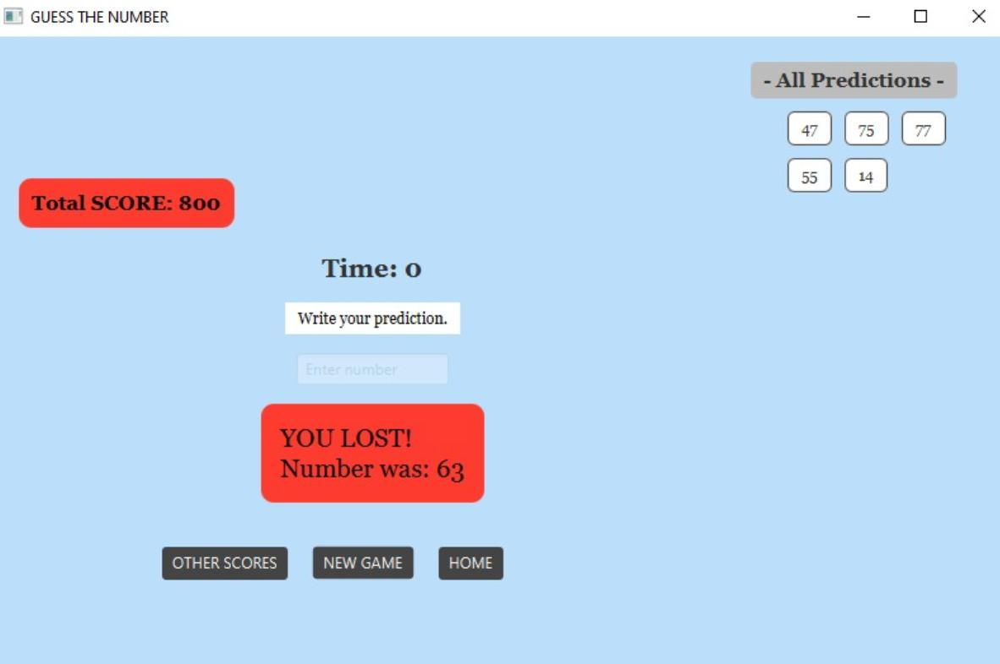
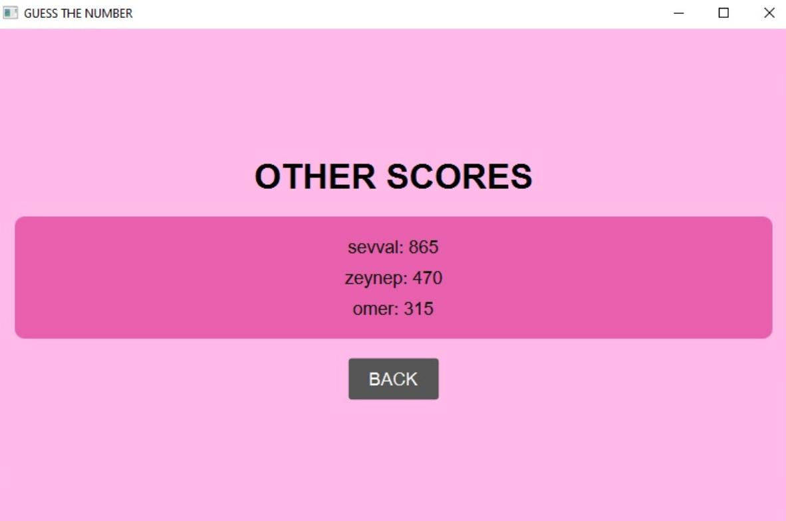

# GuessNumberGame

[GitHub Repository](https://github.com/sevvalbas/GuessNumberGame)

## Overview
GuessNumberGame is a JavaFX-based desktop game where users try to guess a randomly generated number between 0 and 100. The game features user authentication, high score tracking, hints, and a visually engaging interface.

## Features
- User registration and login system
- Each user has a personal high score
- Guess a number between 0 and 100 within 40 seconds
- Points start at 100 and decrease with each wrong guess or hint used
- Animated and colorful UI with JavaFX
- High score leaderboard
- Hints available (with point penalty)
- Persistent user data and scores

## Screenshots
| Login Screen | Main Menu | Game Play | Win | Lose | High Scores |
|--------------|-----------|-----------|-----|------|------------|
|  |  |  |  |  |  |


### Installation
1. Clone the repository:
   ```sh
git clone https://github.com/sevvalbas/GuessNumberGame.git
   ```
2. Open the project in your IDE.

### Running the Game
You can run the game by navigating to RandomAndGuess.java and run the app.


## Project Structure
- `src/main/java/com/example/guessnumgame/RandomAndGuess.java`: Main application class (entry point)
- `src/main/java/com/example/guessnumgame/User.java`: User data model
- `src/main/java/com/example/guessnumgame/UserAuth.java`: Handles authentication UI and logic
- `src/main/java/com/example/guessnumgame/UserManager.java`: Manages user data and high scores
- `images/`: Contains screenshots and UI images


## License
This project is licensed under the MIT License. See the [LICENSE](LICENSE) file for details.

---

> Project by [sevvalbas](https://github.com/sevvalbas/GuessNumberGame) 